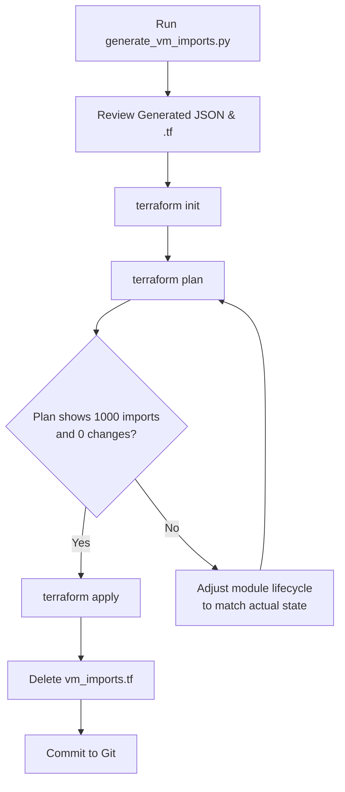

# Clik Reconciler

The Clik Reconciler is a purpose-built automation tool designed to bring "ClickOps" created AWS infrastructure (specifically EC2 instances) under Terraform management at scale (100–1,000+ instances).

## Technical Architecture

The principle: **automate the discovery, generate the config, and let Terraform handle the state reconcilitation.**

```
┌──────────────────────────────────────────────────────────┐
│  Phase 1: DISCOVER                                       │
│  Script queries AWS API → produces structured manifest   │
├──────────────────────────────────────────────────────────┤
│  Phase 2: GENERATE                                       │
│  Script generates vm_instances.auto.tfvars.json          │
│  + Terraform 1.5+ native import {} blocks                │
├──────────────────────────────────────────────────────────┤
│  Phase 3: MODULE                                         │
│  modules/vm/ — A clean, reusable EC2 module              │
├──────────────────────────────────────────────────────────┤
│  Phase 4: IMPORT                                         │
│  terraform plan (import blocks) → terraform apply        │
└──────────────────────────────────────────────────────────┘
```

---

## Technical Performance: O(N) Efficiency

The discovery script (`scripts/generate_vm_imports.py`) is designed for enterprise scale:
- **CPU Complexity:** `O(N)` where N is the number of instances.
- **Network Complexity:** `O(1)` regional round-trips. It solves the **N+1 Query Problem** by bulk-caching all Volume metadata in a single call, then looking up attributes in an in-memory Hash Map. 
- **Scale:** Processes 1,000 instances in ~5 seconds.

---

## Expected Metadata & Outputs

### 1. Reconciler Script Output (Terminal)
When you run `python3 generate_vm_imports.py`, you should see:
```
Caching all Volume metadata (O(1) network calls)...
Fetching EC2 instances...
Generated 1000 VM configurations in ../env/dev/vm_instances.auto.tfvars.json
Generated 1000 import blocks in ../env/dev/vm_imports.tf
```

### 2. Generated JSON Config (`vm_instances.auto.tfvars.json`)
The script produces a machine-readable map that Terraform automatically loads:
```json
{
  "vm_instances": {
    "prod-vm-1": {
      "ami": "ami-12345678",
      "instance_type": "t3.large",
      "subnet_id": "subnet-mock",
      "security_group_ids": ["sg-12345"],
      "key_name": "prod-key",
      "tags": { "Name": "prod-vm-1", "Environment": "Prod" },
      "platform": "linux",
      "root_volume": { "size": 20, "volume_type": "gp3", "encrypted": true },
      "ebs_volumes": {}
    }
  }
}
```

### 3. Generated Import Blocks (`vm_imports.tf`)
These blocks allow Terraform to "claim" existing resources without destroying them:

```hcl
import {
  to = module.infrastructure.module.vm["prod-vm-1"].aws_instance.this
  id = "i-0abcd1234efgh5678"
}
```
### 4. Terraform Plan (Reconciliation Goal)

A successful reconciliation will show:

```bash
**0 additions, 0 changes, and 0 destructions**:
```

```bash
module.infrastructure.module.vm["prod-vm-1"].aws_instance.this: Preparing import...
module.infrastructure.module.vm["prod-vm-1"].aws_instance.this: Refreshing state...

Plan: 1000 to import, 0 to add, 0 to change, 0 to destroy.
```

---


## LocalStack Mock Setup (Testing Workflow)

To test the reconciliation of 100 or 1,000 "ClickOps" VMs without touching real AWS, follow these steps.

### 1. Start LocalStack
Ensure Docker is running, then start LocalStack:

```bash
docker run --rm -d -p 4566:4566 -p 4510-4559:4510-4559 localstack/localstack
```

### 2. Install Mock Tools
Install `awslocal` for easy interaction with the mock cloud:

```bash
pip install awscli-local boto3
```

### 3. Mock the "ClickOps" Infrastructure
Choose your scale. This loop simulates an admin manually creating instances in the console (they exist in AWS but not in Terraform).

#### For 100 VMs:
```bash
for i in {1..100}; do
  awslocal ec2 run-instances \
    --image-id ami-12345678 \
    --count 1 \
    --instance-type t2.micro \
    --tag-specifications "ResourceType=instance,Tags=[{Key=Name,Value=mock-server-$i}]"
done
```

#### For 1,000 VMs:
```bash
for i in {1..1000}; do
  awslocal ec2 run-instances \
    --image-id ami-12345678 \
    --count 1 \
    --instance-type t3.large \
    --tag-specifications "ResourceType=instance,Tags=[{Key=Name,Value=prod-vm-$i}]"
done
```

### 4. Run the Reconciler Discovery
Point the discovery script at LocalStack to generate the Terraform manifests.

```bash
cd scripts
python3 generate_vm_imports.py http://localhost:4566
```

---

## Terraform Import Workflow

Once the script generates `vm_instances.auto.tfvars.json` and `vm_imports.tf`, use Terraform's native import blocks to adopt them.



### 5. Execute Plan
```bash
cd env/dev
terraform init
terraform plan
```

**Output Goal:**
`Plan: 1000 to import, 0 to add, 0 to change, 0 to destroy.`

### 6. Clean Up
After testing, wipe the mock environment:
```bash
docker stop $(docker ps -q --filter ancestor=localstack/localstack)
rm env/dev/vm_imports.tf
rm env/dev/vm_instances.auto.tfvars.json
```

---

## File Structure

```
clik-reconciler/
├── modules/
│   ├── vm/              # EC2 resource wrapper
│   ├── storage/         # Shared S3 buckets
│   └── iam/             # Generic IAM roles/profiles
├── infrastructure/
│   ├── main.tf          # Module wiring
│   └── variables.tf     # Type-strict map(object)
├── env/
│   └── dev/
│       ├── dev.tf       # Environment init
│       ├── locals.tf    # Config values
│       └── localstack_override.tf # For Mocking
└── scripts/
    └── generate_vm_imports.py # Automated Reconciler
```
